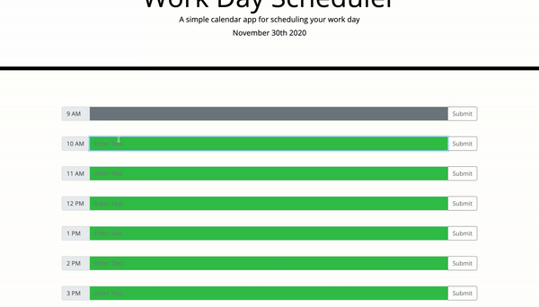

# Work Day Scheduler Powered By jQuery

## Description

This is a simple calendar application that allows a user to save events for each hour of the day by modifying starter code. This app runs in the browser and features dynamically updated HTML and CSS powered by jQuery. This application uses the Moment.js 2.29.1 library to parse, validate, manipulate,
and display dates and times in JavaScript.

### How it Works

Given that an individual would like to use a daily planner to create a schedule...

1. When you open the planner, the current day is displayed at the top of the calendar
2. When you scroll down the webpage, you will be presented with time blocks for standard business hours (9am-5pm). Each time block is color-coded to indicate whether it is in the past, present, or future
3. When you click into a time block, you can enter an event
4. When you click the save button for that time block, the text for that event is saved in local storage
5. When you refresh the page, the saved events persist

### Mock-Up

The following animation demonstrates the applications functionality:

## Table of Contents

- [Installation](#installation)
- [Usage](#usage)
- [Credits](#credits)
- [License](#license)

## Installation

You'll need to use the [**Moment.js**](https://momentjs.com/) library to parse, validate, manipulate, and display dates and times in JavaScript. Be sure to read the documentation carefully and concentrate on using [**Moment.js in the browser**](https://momentjs.com/docs/#/use-it/browser/).

To install this project locally clone this [**project repository**](https://github.com/sayler3/Work-Day-Scheduler) to create a local copy on your computer and sync between the two locations. You may then modify the code to your liking. For steps on how to clone a repository using the command line, read this section of the GitHub Docs [**about cloning a repository**](https://docs.github.com/en/free-pro-team@latest/github/creating-cloning-and-archiving-repositories/cloning-a-repository#about-cloning-a-repository).

## Usage

This simple calendar application can be viewed: [**Here**](https://sayler3.github.io/Work-Day-Scheduler/).

## Credits

The original starter code templete (index.html and style.css) was provided by UC Berkeley Coding Bootcamp.

## License

